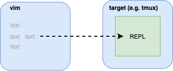

vim-slime
=========

Demo
------------


What is Vim-Slime?
------------------

Context for [SLIME](https://en.wikipedia.org/wiki/SLIME):

    SLIME is an Emacs plugin to turn Emacs into a Lisp IDE. You can type text
    in a file, send it to a live REPL, and avoid having to reload all your code
    every time you make a change.

    Vim-slime is a humble attempt at getting _some_ of these features into Vim.
    It works with any REPL and isn't tied to Lisp.

Grab some text and send it to a target, most probably: [GNU Screen](http://www.gnu.org/software/screen/), [tmux](https://tmux.github.io/) or [Vim Terminal](https://vimhelp.org/terminal.txt.html).



Presumably, your target contains a [REPL](http://en.wikipedia.org/wiki/REPL), maybe Clojure, R or python. If you can type text into it, vim-slime can send text to it.

The reason for doing this? Because you want the benefits of a REPL (instant feedback, no need to reload ...) and the benefits of using Vim (familiar environment, syntax highlighting, persistence ...).

More details in the [blog post](http://technotales.wordpress.com/2007/10/03/like-slime-for-vim/).

Many targets are supported:

- [GNU Screen](#gnu-screen)
- [tmux](#tmux)
- [dtach](#dtach)
- [kitty](#kitty)
- [X11](#x11)
- [whimrepl](#whimrepl)
- [ConEmu](#conemu)
- [Vim :terminal](#vim-terminal)
- [NeoVim :terminal](#neovim-terminal)


Installation
------------

Use your favorite package manager, or use Vim's built-in package support (since Vim 7.4.1528):

    mkdir -p ~/.vim/pack/plugins/start
    cd ~/.vim/pack/plugins/start
    git clone https://github.com/jpalardy/vim-slime.git


Usage
-------------

Put your cursor over the text you want to send and type:

    C-c, C-c       --- the same as slime

_You can just hold `Ctrl` and double-tap `c`._

The current paragraph, what would be selected if you typed `vip`, is automatically
selected. To control exactly what is sent, you can manually select text before calling vim-slime.

Vim-slime needs to know where to send your text, it will prompt you. Vim-slime
will remember your answers and won't prompt you again. But if you need to
reconfigure, type:

    C-c, v         --- mnemonic: "variables"

or call:

    :SlimeConfig


Configuration
-------------

### GNU Screen

By default, [GNU Screen](https://www.gnu.org/software/screen/) is assumed, you don't have to do anything. If you want
to be explicit, you can add this line to your .vimrc:

    let g:slime_target = "screen"

Because Screen doesn't accept input from STDIN, a file is used to pipe data
between Vim and Screen. By default this file is set to `$HOME/.slime_paste`.
The name of the file used can be configured through a variable:

    let g:slime_paste_file = "$HOME/.slime_paste"
    " or maybe...
    let g:slime_paste_file = tempname()

⚠️  This file is not erased by the plugin and will always contain the last thing you sent over.

When you invoke vim-slime for the first time, you will be prompted for more configuration.

screen session name:

    This is what you put in the -S flag, or one of the line from "screen -ls".

screen window name:

    This is the window number or name, zero-based.


### tmux

[Tmux](https://github.com/tmux/tmux) is *not* the default, to use it you will have to add this line to your .vimrc:

    let g:slime_target = "tmux"

Before tmux 2.2, tmux accepted input from STDIN. This doesn't work anymore. To
make it work out without explicit config, the default was changed to use a file
like Screen. By default this file is set to `$HOME/.slime_paste`. The name of
the file used can be configured through a variable:

    let g:slime_paste_file = "$HOME/.slime_paste"
    " or maybe...
    let g:slime_paste_file = tempname()

⚠️  This file is not erased by the plugin and will always contain the last thing you sent over.

When you invoke vim-slime for the first time, you will be prompted for more configuration.

tmux socket name or absolute path:

    If you started tmux with the -L or -S flag, use that same socket name or path here.
    If you didn't put anything, the default name is "default".

tmux target pane:

Note that all of these ordinals are 0-indexed by default.

    ":"       means current window, current pane (a reasonable default)
    ":i"      means the ith window, current pane
    ":i.j"    means the ith window, jth pane
    "h:i.j"   means the tmux session where h is the session identifier
              (either session name or number), the ith window and the jth pane
    "%i"      means i refers the pane's unique id
    "{token}" one of tmux's supported special tokens, like "{last}"

You can configure the defaults for these options. If you generally run vim in
a split tmux window with a REPL in the other pane:

    let g:slime_default_config = {"socket_name": get(split($TMUX, ","), 0), "target_pane": ":.2"}

Or more reliably by employing [a special token](http://man.openbsd.org/OpenBSD-current/man1/tmux.1#_last__2) as pane index:

    let g:slime_default_config = {"socket_name": "default", "target_pane": "{last}"}


### dtach

[dtach](http://dtach.sourceforge.net/) is *not* the default, to use it you will have to add this line to your .vimrc:

    let g:slime_target = "dtach"

When you invoke vim-slime for the first time, you will be prompted for more configuration.

socket_path:

    The path to the Unix-domain socket that the dtach session is attached to.
    The default is /tmp/slime

### kitty

[kitty](https://sw.kovidgoyal.net/kitty/) is *not* the default, to use it you will have to add this line to your .vimrc:

    let g:slime_target = "kitty"

When you invoke vim-slime for the first time, you will be prompted for more configuration.

kitty target window

    This is the id of the kitty window that you wish to target.
    See e.g. the value of $KITTY_WINDOW_ID in the target window.

### X11

[x11](http://manpages.ubuntu.com/manpages/trusty/man1/xdotool.1.html) is *not* the default, to use it you will have to add this line to your
.vimrc:

    let g:slime_target = "x11"

When you invoke vim-slime for the first time, you will have to designate a
target window by clicking on it.

#### Troubleshooting
If `SlimeConfig` hangs without asking you to select a target terminal, you may not have `xdotool` installed.

If `SlimeConfig` works and you can send text to the terminal window running vim but not to other terminal windows, your terminal may be configured to ignore the XSendEvent events generated by xdotool by default. See the SENDEVENT NOTES section of the [xdotool man page](http://manpages.ubuntu.com/manpages/trusty/man1/xdotool.1.html#SendEventNotes) for details. Note also that allowing arbitrary programs to send text to your terminal to be executed is potentially a security vulnerability.
 
### whimrepl

[whimrepl](https://github.com/malyn/lein-whimrepl) is *not* the default, to use it you will have to add this line to your .vimrc:

    let g:slime_target = "whimrepl"

When you invoke vim-slime for the first time, you will be prompted for more configuration.

whimrepl server name

    This is the name of the whimrepl server that you wish to target.  whimrepl
    displays that name in its banner every time you start up an instance of
    whimrepl.

### ConEmu

[ConEmu](https://conemu.github.io/) is *not* the default, to use it you will have to add this line to your .vimrc:

    let g:slime_target = "conemu"

When you invoke vim-slime for the first time, you will be prompted for more
configuration.

ConEmu console server HWND

    This is what you put in the -GuiMacro flag. It will be "0" if you didn't put
    anything, addressing the active tab/split of the first found ConEmu window.

By default the windows clipboard is used to pass the text to ConEmu. If you
experience issues with this, make sure the `conemuc` executable is in your
`path`.

### Vim :terminal

[Vim :terminal](https://vimhelp.org/terminal.txt.html) is *not* the default, to use it you will have to add this line to your .vimrc:

    let g:slime_target = "vimterminal"

When you invoke vim-slime for the first time, you will be prompted for more
configuration.

Vim terminal configuration can be set by using the following in your .vimrc:

    let g:slime_vimterminal_config = {options}

You can specify if you have frequently used commands:

    let g:slime_vimterminal_cmd = "command"

If you use Node, set it as follows:

    let g:slime_vimterminal_cmd = "node"

You can make the vim terminal closed automatically, 
if you set the `g:slime_vimterminal_cmd`:

    let g:slime_vimterminal_config = {"term_finish": "close"}

for possible options, see :help term_start()

### NeoVim :terminal

[NeoVim :terminal](https://neovim.io/doc/user/nvim_terminal_emulator.html) is *not* the default, to use it you will have to add this line to your .vimrc:

    let g:slime_target = "neovim"

When you invoke vim-slime for the first time, you will be prompted for more
configuration. The last terminal you opened before calling vim-slime will
determine which `job-id` is presented as default.

To manually check the right value of `job-id` to use, try:

    echo &channel

from the buffer running your terminal.

Advanced Configuration
----------------------

If you need this, you might as well refer to [the code](https://github.com/jpalardy/vim-slime/blob/master/plugin/slime.vim#L233-L245) 😄  
Seriously, it's not a complicated as it seems.

If you don't want the default key mappings, set:

    let g:slime_no_mappings = 1

The default mappings are:

    xmap <c-c><c-c> <Plug>SlimeRegionSend
    nmap <c-c><c-c> <Plug>SlimeParagraphSend
    nmap <c-c>v     <Plug>SlimeConfig

If you want vim-slime to prefill the prompt answers, you can set a default configuration:

    " screen:
    let g:slime_default_config = {"sessionname": "xxx", "windowname": "0"}

    " tmux:
    let g:slime_default_config = {"socket_name": "default", "target_pane": "1"}

If you want vim-slime to bypass the prompt and use the specified default configuration options, set the `g:slime_dont_ask_default` option:

    let g:slime_dont_ask_default = 1

By default, vim-slime will try to restore your cursor position after it runs. If you don't want that behavior, unset the `g:slime_preserve_curpos` option:

    let g:slime_preserve_curpos = 0

If you want to send blocks of code between two delimiters, emulating the cell-like mode of REPL environments like ipython, matlab, etc., you can set the cell delimiter on the `g:slime_cell_delimiter` variable and use the `<Plug>SlimeSendCell` mapping to send the block of code. For example, if you are using ipython you could use the following:

    let g:slime_cell_delimiter = "#%%"
    nmap <leader>s <Plug>SlimeSendCell

⚠️  it's recommended to use `b:slime_cell_delimiter` and set the variable in `ftplugin` for each relevant filetype.


Advanced Configuration: Overrides
---------------------------------

At the end of the day, you might find that vim-slime _ALMOST_ does everything
you need, but not quite the way you like it. You might be tempted to fork it,
but the idea of writing and maintaining vimscript is daunting (trust me: I sympathize 😐).

You can override _some_ logic and still benefit from the rest of vim-slime.
Here's the mental model you need to understand how things work:

1. you invoke a key binding and vim-slime grabs a chunk of text
2. depending on which language you are using (see below), the text might be "transformed" and "massaged" to paste correctly
3. if the config is missing, the user is prompted to fill in the blanks
4. a target-specific function is called to delegate the "send this text to the right target" part
5. the target receives the right text, the right way, and everything works

There is some good news, for step 2, 3, 4, you can override the logic with your
own functions! Put these functions in your `.vimrc` and hijack the part you
need.

You can override any or all (zero to many) of these functions, as needed.

Why is this awesome?

- skip vimscript: delegate to an external script; written in your own preferred language
- optimize for you: treat yourself with just-for-you customizations and hardcoded values
- ultimate power: beyond config and flags, passing a function means you can do anything you want

You might still need some vimscript to glue things together. Leaning on the
vim-slime code for examples might get you 90% of what you need. If not, there's
always [Learn Vimscript the Hard Way](https://learnvimscriptthehardway.stevelosh.com/).

If you feel others can benefit from your customizations, open a PR and we'll find a way.


### How to override "language transformations"?

Write a function named `SlimeOverride_EscapeText_#{language}`:

```vim
function SlimeOverride_EscapeText_python(text)
  return system("some-command-line-script", a:text)
endfunction
```

This example code, for Python in this case, pushes the selected text to `some-command-line-script`
through STDIN and returns whatever that script produced through STDOUT.

Contract:
- input is selected text
- output is string or an array of strings (see other `ftplugin` for details)

### How to override "configuration"?

Write a function named `SlimeOverrideConfig`:

```vim
function SlimeOverrideConfig()
  let b:slime_config = {}
  let b:slime_config["key"] = input("key: ", "default value")
endfunction
```

Contract:
- no input, but...
- `b:slime_config` might contain `g:slime_default_config` if it was defined, or be undefined otherwise
- no output but...
- `b:slime_config` expected to contain necessary keys and values used by the target send function (up next)

### How to override "send to target"?

Write a function named `SlimeOverrideSend`:

```vim
function SlimeOverrideSend(config, text)
  echom a:config
  call system("send-to-target --key " . a:config["key"], a:text)
endfunction
```

Contract:
- inputs are config (from config function, above or default) and selected text (post transformation)
- no output but...
- expected to do whatever is needed to send to target, probably a call to `system` but see code for details


Language Support
----------------

Vim-slime _might_ have to modify its behavior according to the language or REPL
you want to use.

Many languages are supported without modifications, while [others](ftplugin)
might tweak the text without explicit configuration:

  * [coffee-script](ftplugin/coffee/slime.vim)
  * [fsharp](ftplugin/fsharp/slime.vim)
  * [haskell](ftplugin/haskell/slime.vim) / [lhaskell](ftplugin/haskell/slime.vim) -- [README](ftplugin/haskell)
  * [matlab](ftplugin/matlab/slime.vim)
  * [ocaml](ftplugin/ocaml/slime.vim)
  * [python](ftplugin/python/slime.vim) / [ipython](ftplugin/python/slime.vim) -- [README](ftplugin/python)
  * [scala](ftplugin/scala/slime.vim) / [ammonite](ftplugin/scala/slime.vim) -- [README](ftplugin/scala)
  * [sml](ftplugin/sml/slime.vim)
  * [stata](ftplugin/stata/slime.vim)

