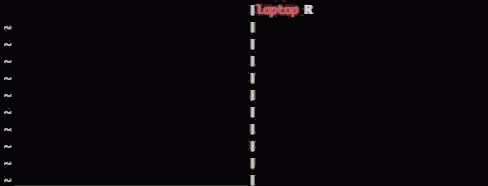

vim-slime
=========

Demo
------------

What is Vim-Slime?
------------------

Context for [SLIME](https://en.wikipedia.org/wiki/SLIME):

    SLIME is an Emacs plugin to turn Emacs into a Lisp IDE. You can type text
    in a file, send it to a live REPL, and avoid having to reload all your code
    every time you make a change.

    Vim-slime is a humble attempt at getting _some_ of these features into Vim.
    It works with any REPL and isn't tied to Lisp.

Grab some text and send it to a [GNU Screen](http://www.gnu.org/software/screen/) / [tmux](https://tmux.github.io/) / [whimrepl](https://github.com/malyn/lein-whimrepl) / [ConEmu](http://conemu.github.io/) session / NeoVim Terminal / Vim Terminal

    VIM ---(text)---> screen / tmux / whimrepl / ConEmu / NeoVim Terminal / Vim Terminal

Presumably, your session contains a [REPL](http://en.wikipedia.org/wiki/REPL), maybe Clojure, R or python. If you can type text into it, vim-slime can send text to it.

The reason you're doing this? Because you want the benefits of a REPL and the benefits of using Vim (familiar environment, syntax highlighting, persistence ...).

More details in the [blog post](http://technotales.wordpress.com/2007/10/03/like-slime-for-vim/).

Installation
------------

I recommend installing [pathogen.vim](https://github.com/tpope/vim-pathogen), and
then simply copy and paste:

    cd ~/.vim/bundle
    git clone git://github.com/jpalardy/vim-slime.git

If you like it the hard way, copy plugin/slime.vim from this repo into ~/.vim/plugin.

Usage
-------------

Put your cursor over the text you want to send and type:

    C-c, C-c       --- the same as slime

_You can just hold `Ctrl` and double-tap `c`._

The current paragraph, what would be selected if you typed `vip`, is automatically
selected. To control exactly what is sent, you can manually select text before calling vim-slime.

Vim-slime needs to know where to send your text, it will prompt you. Vim-slime
will remember your answers and won't prompt you again. But if you need to
reconfigure, type:

    C-c, v         --- mnemonic: "variables"

or call:

    :SlimeConfig

Configuration
-------------

### GNU Screen

By default, GNU Screen is assumed, you don't have to do anything. If you want
to be explicit, you can add this line to your .vimrc:

    let g:slime_target = "screen"

Because Screen doesn't accept input from STDIN, a file is used to pipe data
between Vim and Screen. By default this file is set to `$HOME/.slime_paste`.
The name of the file used can be configured through a variable:

    let g:slime_paste_file = "$HOME/.slime_paste"
    " or maybe...
    let g:slime_paste_file = tempname()

WARNING: This file is not erased by the plugin and will always contain the last thing
you sent over.

When you invoke vim-slime for the first time, you will be prompted for more configuration.

screen session name:

    This is what you put in the -S flag, or one of the line from "screen -ls".

screen window name:

    This is the window number or name, zero-based.

### tmux

Tmux is *not* the default, to use it you will have to add this line to your .vimrc:

    let g:slime_target = "tmux"

Before tmux 2.2, tmux accepted input from STDIN. This doesn't work anymore. To
make it work out without explicit config, the default was changed to use a file
like screen. By default this file is set to `$HOME/.slime_paste`. The name of
the file used can be configured through a variable:

    let g:slime_paste_file = "$HOME/.slime_paste"
    " or maybe...
    let g:slime_paste_file = tempname()

WARNING: This file is not erased by the plugin and will always contain the last thing
you sent over.

When you invoke vim-slime for the first time, you will be prompted for more configuration.

tmux socket name or absolute path:

    If you started tmux with the -L or -S flag, use that same socket name or path here.
    If you didn't put anything, the default name is "default".

tmux target pane:

Note that all of these ordinals are 0-indexed by default.

    ":"     means current window, current pane (a reasonable default)
    ":i"    means the ith window, current pane
    ":i.j"  means the ith window, jth pane
    "h:i.j" means the tmux session where h is the session identifier
            (either session name or number), the ith window and the jth pane
    "%i"    means i refers the pane's unique id

You can configure the defaults for these options. If you generally run vim in
a split tmux window with a REPL in the other pane:

    let g:slime_default_config = {"socket_name": split($TMUX, ",")[0], "target_pane": ":.2"}

### whimrepl

whimrepl is *not* the default, to use it you will have to add this line to your .vimrc:

    let g:slime_target = "whimrepl"

When you invoke vim-slime for the first time, you will be prompted for more configuration.

whimrepl server name

    This is the name of the whimrepl server that you wish to target.  whimrepl
    displays that name in its banner every time you start up an instance of
    whimrepl.

### ConEmu

ConEmu is *not* the default, to use it you will have to add this line to your .vimrc:

    let g:slime_target = "conemu"

When you invoke vim-slime for the first time, you will be prompted for more
configuration.

ConEmu console server HWND

    This is what you put in the -GuiMacro flag. It will be "0" if you didn't put
    anything, adressing the active tab/split of the first found ConEmu window.

By default the windows clipboard is used to pass the text to ConEmu. If you
experience issues with this, make sure the `conemuc` executable is in your
`path`.

### Vim :terminal

Vim :terminal is *not* the default, to use it you will have to add this line to your .vimrc:

    let g:slime_target = "vimterminal"

When you invoke vim-slime for the first time, you will be prompted for more
configuration.

Vim terminal configuration can be set by using the following in your .vimrc:

    let g:slime_vimterminal_config = {options}

for possible options, see :help term_start()

### NeoVim terminal

NeoVim :terminal is *not* the default, to use it you will have to add this line to your .vimrc:

    let g:slime_target = "neovim"

When you invoke vim-slime for the first time, you will be prompted for more
configuration.

Advanced Configuration
----------------------

If you need this, you might as well refer to [the code](https://github.com/jpalardy/vim-slime/blob/master/plugin/slime.vim#L233-L245) :-)

If you don't want the default key mappings, set:

    let g:slime_no_mappings = 1

The default mappings are:

    xmap <c-c><c-c> <Plug>SlimeRegionSend
    nmap <c-c><c-c> <Plug>SlimeParagraphSend
    nmap <c-c>v     <Plug>SlimeConfig

If you want vim-slime to prefill the prompt answers, you can set a default configuration:

    " screen:
    let g:slime_default_config = {"sessionname": "xxx", "windowname": "0"}

    " tmux:
    let g:slime_default_config = {"socket_name": "default", "target_pane": "1"}

If you want vim-slime to bypass the prompt and use the specified default configuration options, set the `g:slime_dont_ask_default` option:

    let g:slime_dont_ask_default = 1

By default, vim-slime will try to restore your cursor position after it runs. If you don't want that behavior, unset the `g:slime_preserve_curpos` option:

    let g:slime_preserve_curpos = 0

Language Support
----------------

Vim-slime _might_ have to modify its behavior according to the language or REPL
you want to use.

Many languages are supported without modifications, while [others](ftplugin)
might tweak the text without explicit configuration:

  * coffee-script
  * fsharp
  * haskell / lhaskell -- [README](ftplugin/haskell)
  * ocaml
  * python / ipython -- [README](ftplugin/python)
  * scala
  * sml
